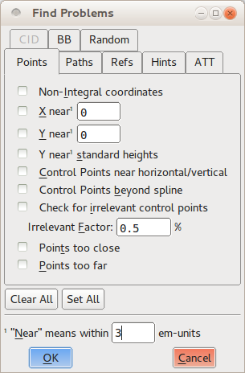
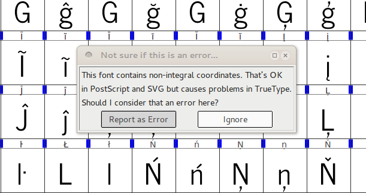
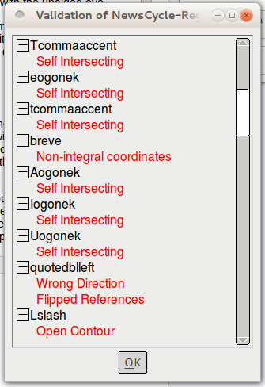
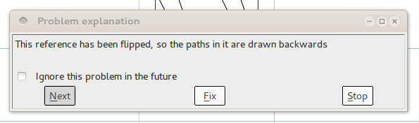

在一个完美的世界中，你的字体随时可以构建并安装在任何现代计算机上而不需要做任何额外的努力，但是现实是混乱的 &mdash; 尤其是在设计进程中。字体可能有阻止他们正常工作和显示的技术性错误。例如和自己相交的曲线不会正确渲染，因为他们没有“里面”和“外面”。各种各样的字体文件类型也期望字形附加在某些简化文本放在屏幕上的某些规则，破坏这些规则的字体可能引起意外问题。这种类型问题的一个例子是一条曲线上的所有点的坐标应该是整数。最后，有一些非技术性错误的样式错误，但是你也要修复它们 &mdash; 比如想要完全水平或竖直的线，但是偶尔轻微离开。

FontForge提供了工具让你可以定位（并且在许多情况下修复）所有的三类问题。验证你的字体来消除这些错误不仅可以确保用户可以安装并享受字体，而且可以确保完成的项目表现得耀眼。

## 发现问题

第一个工具叫做em>Find Problems</em>，可以在Element菜单下找到。你必须首先选择一个或多个字形 &mdash; 从字体视图或者轮廓视图或者度量值视图 &mdash; 然后打开Find Problems工具。这个工具在八个分开的选项卡下展示潜在问题的混合。

你选择你感兴趣寻找的问题，方法是勾选它们旁边的复选框，有些还提供了用于检查字体的数字值。当你点击OK按钮时，这个工具将会检查所有选中的字形并在一个对话框内报告它找到的任何问题的报告。

Find Problems工具找到的问题被分成八类：

* 点相关的问题
* 路径和曲线的问题
* 引用的问题
* 提示（Hinting）的问题
* ATT的问题
* CID字体特有的问题
* 边界框问题
* 各种其他问题

并不是每个检查都是必要的；一些只应用在特定的书写字母或者语言（比如“CID”选项卡中的那些），另一些只应用在特定可选择的字体特性（比如在引用选项卡中的检查）。但是你应该检查你的字体是否通过字形的必要特性的测试和一些可选但是通常的行为的测试。几个其他测试在设计进程中为你提供给了反馈和指导，因此值得探索。

### 先说重要的：测试必要特性

在“Points”选项卡，选择<em>Non-Integral Coordinates</em>测试。这个测试确保每个字形中的所有点（包括弧线上的点和控制点）都有整数坐标。并不是每个字体输出格式需要这个行为，但是一些需要。

在“Paths”选项卡，选择选项<em>Open paths</em>和<em>Check outermost paths clockwise</em>。他们都是所有字体的强制特性；第一个寻找任何不是闭合形状的曲线，第二个确保每个字形的外部曲线是沿着顺时针顺序。这也是一个检查<em>交叉路径</em>的非常好的主意；尽管现代字体格式可以支持两个交叉路经，但是并不允许与自己交叉的曲线。另外如果一个字形有与自己相交的路径那么FontForge不能执行<em>Check outermost paths clockwise</em>测试。

在“Refs”选项卡，选择所有的6个测试。这些将检查所有相关的引用，引用中一个字形包含另一个字形的路径。例如一个带重音的字母包含了一个到原始（无重音的）字母的引用，加上一个到重音自负的引用。在“Refs”选项卡下的所有测试至少对于一个通常输出格式是强制的，对所有的来说是好主意。

类似地，选择“ATT”选项卡下的所有测试。这些测试寻找缺失的字形名称，引用不存在字形的替代规则，和其他字形名称活OpenType特性相关的问题。它们防止的问题并不常用，但是所有的都将导致字体被一个或多个电脑系统认为是无效的，因此它们值得被包含进来。

### 让你的用户生活更容易：测试好的行为

上面列出的测试将会保证你的字体按照多种字体格式设置的规则集合正确地安装和渲染，但是你应该在考虑添加一些其他测试 &mdash; 尤其是在设计进程的结束 &mdash; 仅仅因为它们检查大部分现代印刷格式遵循的公约。

在“Points”选项卡，选择<em>Control points beyond spline</em>。这个测试将寻找处于其所属的曲线段的端点外的控制点。很少有一个控制点应该处于曲线以外的原因，因此这样的情况通常意味着意外。选择<em>Points too far apart</em>也是一个好主意，它将会查找距离最近的点超过32767单位的点。这个距离比大多数计算机能够内部处理的更大，并且一个那么远的点几乎必然不是故意的（可以对比的是，一个字形倾向于会只在一个大约1000单位的网格中），因此删除这样的点是重要的。

在“Paths”选项卡，<em>Check Missing Extrema</em>和<em> More Points Than [val]</em>测试可以是有价值的。第一个寻找处于极值的点 &mdash; 也就是字形的最高点、最低点和最左点和最右点。现代字体格式强烈建议每个路径都有一个处于其水平和垂直上极值的点；在字体渲染在屏幕或页面上时，这将让生活更美好。检查将会查找缺失的极值点。第二个测试是一个对字形中点的数量的明智的检查。FontForge中这个检查的默认值是1500个点，这是PostScript文档中建议的值，对几乎所有字体都足够好。

正如其名字一样，“Random”选项卡列出不属于其他类别的杂项测试。当然，最后三个是有价值的：<em>Check Multiple Unicode</em>，<em>Check Multiple Names</em>和<em>Check Unicode/Name mismatch</em>。它们寻找字形名称和Unicode码之间映射的元数据错误。

### 帮助你自己: 运行测试可以援助设计

Find Problems工具中的许多其他测试有助于找到并定位你的字形集中的矛盾之处；不是错的或者无效的但是作为设计者的你希望打磨的东西。例如“Points”选项卡中的<em>Y near standard heights</em>测试将字形与一个有用的竖直测量值集合来比较，包括基线、字形“x”的高度、字母“p”的最低点和最高点等。在一个一致的字体样式中，大多数字母将依附到这些标准测量值中的几个，因此一个并不靠近其中任何一个的字形需要大量的工作。

在“Paths”选项卡中的<em>Edges near horizontal/vertical/italic</em>功能寻找几乎是精确地处于水平、竖直或者处于字体倾斜角度的线段。将你几乎竖直的线条做成完美竖直意味着在你的字体使用时图形将会锐利地渲染，这个测试是找到在眼睛没有帮桌的情况下难以察觉到的不十分正确的线段的可靠的手段。

你可以使用其他测试来定位曲线上互相太靠近的点而没有意义，来比较形状类似字形的旁边空白，来执行一些当你有古怪的字符时揭露问题。改善进程的一部分是采用你最初的设计并使他们更加精确；像字体设计的其他方面一样，这是一个迭代的任务，因此使用使用内建的工具以减少一些重复工作。

## 验证字体

FontForge的其他验证工具时全字体验证器，在整个字体上做一系列的测试和检查。由于验证器是用来检查整个字体的，因此你只能从字体视图窗口运行他；你可以再Element菜单的Validation子菜单中找到它。验证器设计用于运行一些检查字体技术上正确性的测试 &mdash; 本质上是上面“测试必要特性”一节描述的测试。但是它确实在整个字体上执行测试，并且比你自己用Find Problems工具一步步完成的进程要迅速很多。

在一个特别的编辑期间你第一次运行验证器的时候，他将会弹出一个对话框询问你它是否应该将非整型的点坐标当作是错误。安全的答案是选择“Report as an error”，因为附着在整型坐标上是一个好的设计实践。当验证器完成它对字体的扫描时（将仅仅是几秒钟之后），它将会弹出一个新的名为<em>Whatever Your Font Name Is</em>的验证对话框这个窗口将会列出验证器找到的所有问题，展现在按字形排序的列表中。

但是这个窗口不仅仅是一个错误的列表；你可以双击列表中的每个条目，FontForge将会跳转到相关字形并高亮显示确切的问题，最后在它自己的窗口中展示文本说明。然后你可以再字形编辑器中修复问题，关联的错误条目将会立即从验证器的错误列表中消失。在许多情况下，错误可以被FontForge自动修复；在这些情况下说明窗口将会在底部包含一个“Fix”按钮。你可以点击它执行修复而不需要额外努力。

对于一些问题，并不能自动修复，但是在屏幕上看到问题将有助于你立即修复。例如一个自交曲线在一个特定的地方上路径穿过它自己 &mdash; 这对于你来说可能很难一眼瞥到，按时放大后你就可以改造形状消除问题。

对于另一些问题来说，并不能将错误定位到某一个特定的点。例如如果一条曲线沿着错误的方向（也就是应该是顺时针的时候反而是逆时针），那么整个曲线都会受到影响。在这些情况下FontForge不能自动修复问题，验证器也无法高亮没有字形中特定的点，你可能四处寻找以期手动改正问题。

最后，有一些验证器执行的测试可能并不是来自你心里想要的最终输出格式的问题 &mdash; 例如之前提到的非整型坐标。在这些情况下你可以点击错误说明窗口“ignore this problem in the future”复选框，在未来运行验证的时候抑制特定错误信息。

## 在你编辑时修复问题

大多数Find Problem工具和整个字体验证器找到的错误可以在编辑进程中改正，因此在你工作时不要觉得有任何推迟故障排除的需要。例如View &gt; Show 子菜单有选项可以在编辑时高亮问题区域；Element菜单下的命令比如<em>Add Extrema</em>将会为大多数输出文件格式添加期望的极值点，复选框指示指示选择的路径是否朝向顺时针还是逆时针方向。如果你在字形编辑器中翻转一个图形（水平或者竖直翻转），那么你讲注意到它的方向也被自动颠倒。如果你点击Element菜单下的<em>Correct Direction</em>命令，FontForge将会立即修复顺时针/逆时针方向。养成在工作时像这样做小的修复的习惯，将会在随后的验证阶段为你节约一点时间。

# 设计是否起作用?  

字体样式可以通过两种方式工作地更好或更差；可读性可易读性。

易读性意味着字形的设计足够明显可以立即正确地认出。有一些经常太过类似的字符对：

* 字母“L”和数字“1”
* 字母“O”和数字“0”
* 字母“Z”和数字“2”
* 数字“1”和“7”

可读性意味着所有字形为了更熟悉、舒适的阅读体验而共同工作。创建测试文档是最好的确保这一点的方式。如果你有完整的字母表，那么你可以排版真实的文本 &mdash; 例如使用[FontFriend](http://somadesign.ca/projects/fontfriend/)将你的字体拖动你希望读的一个长新闻中，然后打印出它来。

但是如果你的字体只包含字母部分，你可以使用一个测试文本生成器，比如[LibreText.org](http://libretext.org)和任何字处理器，桌面出版应用程序或者一般演示程序（比如[Inkscape](http://www.inkscape.org)）来创建测试文档。
