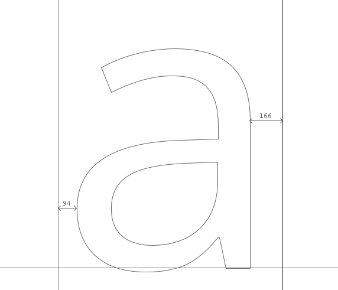
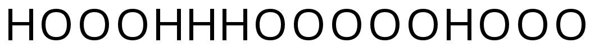
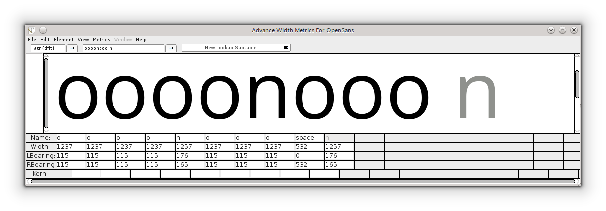
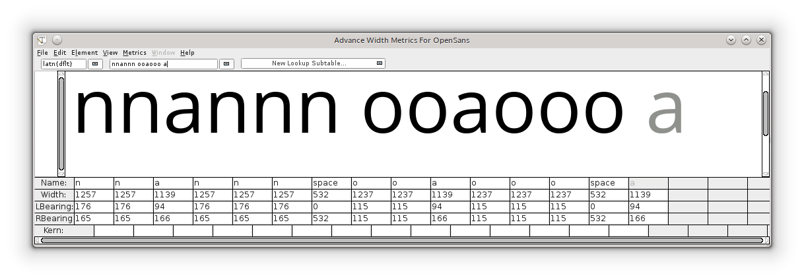
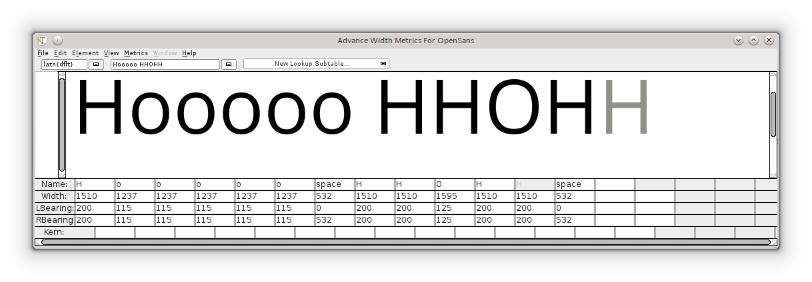
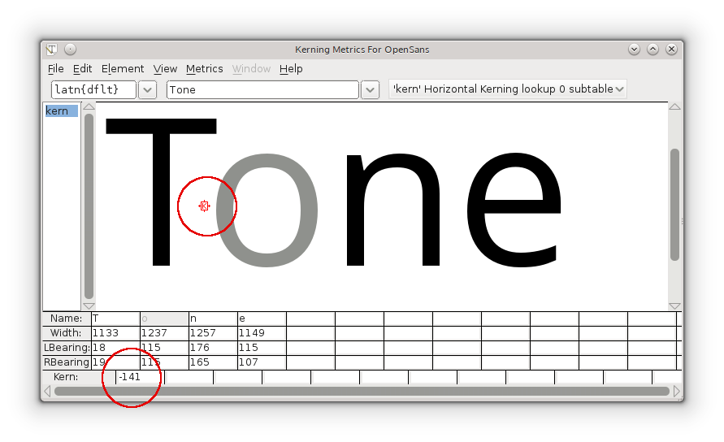
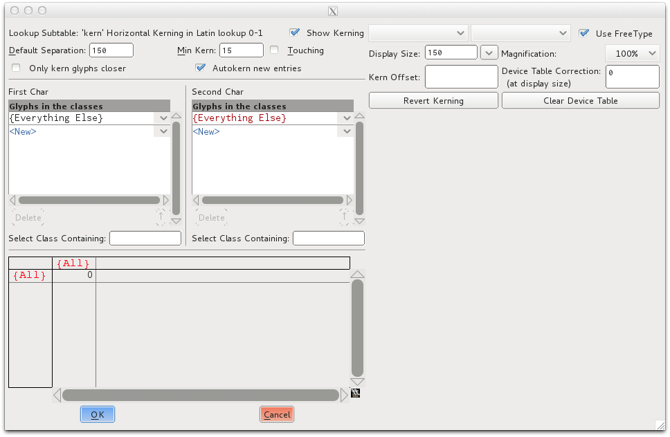
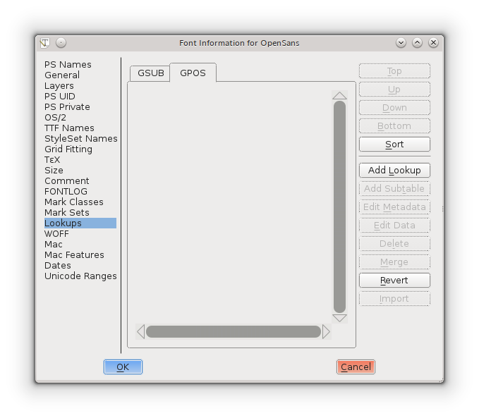
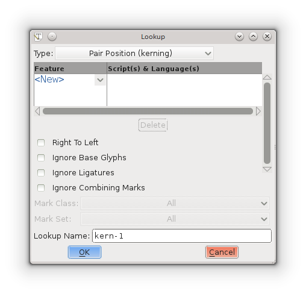
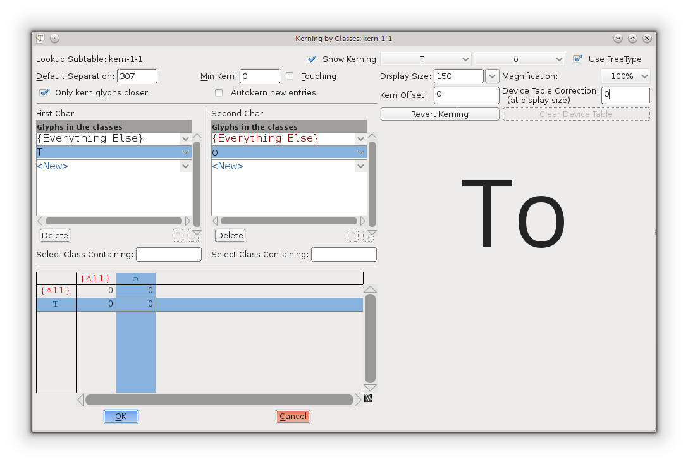

字符之间的距离是字体设计中重要的必须的一部分。

字体的字母间距的设计应该作为字体设计整个进程的必须部分来展开。好的间距对一个字体正常运行时必须的。

在FontForge中，度量值（Metrics）窗口允许你设计字体的度量值，修改他们之间的间距，并测试字形放在一起看起来怎么样。度量值窗口可以从“Window”菜单或者<kbd>Ctrl</kbd> + <kbd>K</kbd>命令打开。

任意两个字形间的间距分为两部分；第一个字形后的间距和第二个字形前的间距。字形间的这些间距是由两个字形间的“旁边空白”组成。每个字形有一个左跨距和一个右跨距，在下面的Open Sans字体的小写字母“a”的例子中，右跨距的值是166单位，左跨距的值时94单位。

## 度量值窗口的基本功能

字符的旁边空白在FontForge的度量值窗口中可以用5种方式编辑：

- 手动拖动每边空白的边界。

- 手动拖动一个字符。需要注意的是拖动一个字符将只影响左跨距的值。

- 旁边空白的值可以通过在度量值窗口的Metrics表格中直接编辑。

- 旁边空白的值可以通过快捷键增减/减少。

- 使用度量值窗口的Metrics菜单中的命令。

<strong>使用键盘调整旁边空白的值。</strong>

在FontForge中快速精确地调整度量值的一个方法是使用键盘的上下左右键。上下键用来增加和减少值，<kbd>Alt</kbd> + <kbd>上</kbd>、<kbd>Alt</kbd> + <kbd>下</kbd>、<kbd>Alt</kbd> + <kbd>左</kbd>、<kbd>Alt</kbd> + <kbd>右</kbd>用来到在度量值窗口中导航到周围不同的字段。

## 一般原则

作为一般原则，对称字符比如“A”、“H”、“I”、“M”、“N”、“O”、“T”、“U”、“V”、“W”、“X”、“Y”、“o”、“v”、“w”、“x”将会有对称的旁边空白，比如“H”的左跨距和右跨距值将会相同。需要注意的是尽管如此，这并不是一个硬性规则，而是一般规则。

在你调整你设计的字符的空间时，你应该相信自己的眼睛。大概方法是“设计-观察-调整-再观察”。

对于不折不扣的新手，不要假设可靠的结果以来测量间距来取得。例如虽然两个字符间的测量值不相等，但是眼睛看起来是相等的。一个明显的这样的例子在尝试调整字符“H”和“O”的间距的时候可以看到。因此对于下面的例子，“H”和“O”的旁边空白相等，但是看起来不相等。在下面的一条线上，旁边空白不相等但是间距看起来是平衡的。

产生这样文本的一个工具在<http://tools.ninastoessinger.com/>

## 用来编辑度量值的Metrics菜单命令

“Center in Width” - 这个命令将当前字形放置在其宽度的中央。

“Window Type” - FontForge的度量值窗口内可以通过两种方式调整度量值：

- “Advance Width Only” - 在这种模式下，度量值视图只能用来调整字形的步进宽度。

- “Both” - 在这种模式下度量值视图将会调整步进宽度和字距值。

“Set Width” - 这个命令允许你改变当前字形的宽度。

“Set LBearing” - 允许你改变左跨距的值。

“Set RBearing” - 允许你改变右跨距的值。

## 一个调整间距的基本方法

下面的方法是用来让你开始高效地设计你的字体的度量值。

从度量值窗口的一个小写字母“o”的字符串开始，左边和右边的空白可以调整直到字符间距看起来感觉对。寻找这个正确的位置的一个方法是寻找“o”字符之间的空白来平衡字符“o”内的空白。通常出了斜体字体外，小写字母“o”的左边和右跨距应该值相等。一旦你满意“o”字符串间距，从你的字体中引进“n”（如下）并通过观察调整“n”的旁白空白着这样它的间距适合“o”字符串的平衡（如下）。需要注意的是由于我们的眼睛看东西的本性，“n”的右跨距值总是比左跨距的值小，“o”的旁白空白比“n”的旁边空白小。

一旦“n”和“o”都有了充分间距，那么他们的旁边空白可以用来创建一组其他字母的旁边空白，例如：

- “o”的右跨距可以用于“c”，“d”，“e”和“q”的旁边空白。

- “o”的左跨距可以用于“b”和“p”的左跨距。

- “n”的右跨距可以用于“h”和“m”的左跨距。

- “n”的左跨距可以用于“b”，“h”，“k”，“m”，“p”和“r”的左跨距。

<b>注意：</b>上述应该用作指南，可以用作找到这些旁边空白值的一个超有效的出发点。

如上图所示，这对于使用“n”和“o”的字符串来调整剩余小写字母的旁边空白间距是有意义的。再次强调，相信你的眼睛来达到字符的正确平衡。

## 大写字母

大写字母可以用如上相同的原则来调整间距。例如从字符串“Hooooo”开始，调整“H”的右跨距直到感觉与“o”字符串平衡。由于“H”的左跨距等于右跨距，那么大写字母“O”可以通过“H”来调整间距（如下）。

通过已经调整好间距的字符来从这里调整所有其他字符间距。需要注意这个方法可以用作调整字体间距的好的起点，但是很可能需要花费更多时间很好地微调间距来实现较高层次的好的字母间距。其他在这里有用的字符串包括“naxna”，“auxua”，“noxno”，“Hxndo”。

## 紧缩

紧缩是特定字母对之间间距的调整。紧缩允许你在两个字符之间应用除了字符提供的旁边空白外的独立间距。需要紧缩来改善间距的常见一对字符例子有“WA”，“Wa”，“To”，“Av”。在下面的例子中，我们可以看到没有紧缩间距的一对字母“T-o”和“V-a”太宽了，这些字符对在紧缩间距后字体的其他间距的感觉更加平衡。

FontForge的度量值窗口可以用来设计旁边空白和紧缩值。在FontForge中紧缩值可以通过一些方法来应用，其中两种方法在下面展示，类别紧缩和独立对紧缩。

## FontForge的Metrics菜单

“Window Type” - FontForge的Metrics窗口可以通过两种方式实现紧缩调整：

- “Kerning Only” - 在这种模式下度量值视图只能用来调整紧缩。

- “Both” - 在这种模式下度量值视图将会调整步进宽度或紧缩值。

“Kern By Classes” - 这个命令提供一个操作紧缩类别的对话框给用户。

“Kern Pair Closeup” - 这个命令提供一个可以调整已有的紧缩对或者创建新的紧缩对的对话框给用户（如下）。

## 使用键盘调整紧缩值

像调整旁边空白值一样，在FontForge中紧缩值也可以通过键盘的上下左右键快速准确修改。上键和下键用来增加/减少值，alt+上、alt+下、alt+左、alt+右用来在度量值窗口中导航到周围的不同字段。

## 紧缩独立的对

在FontForge中这是创造紧缩的对的最基本的方法。在度量值窗口中，两个字符的紧缩值可以通过拖动右边字符接近或远离左边字符或者在窗口的度量值表格中直接编辑紧缩值来手动调整。通过拖动字符来修改紧缩值，则使用在鼠标指针悬停在两个字符之间时出现的紧缩工具手柄（屏幕截图如下）。度量值表格中的紧缩值可以通过手动输入值编辑或者使键盘上下键来增加/减少值。

## 使用类别紧缩

“紧缩类别”可以在FontForge中创造来构建拥有相同紧缩值的字符组。例如我们创造了一个称为“o_left_bowl”的类别，其中包括的字符“o”、“c”、“d”、“e”、“q”在前面有字符例如“T”的时候将总是有相同的紧缩值。“T”本身也可以是包含其他字符的另一个类别，比如Tcaron和Tbar的成员。类别紧缩可以有效地节省你的许多时间。

创造紧缩类别的最直接的方式是使用FontForge的度量值菜单的“Kern by classes”。
 
- 选择“Kern by classes”，可以看到“new lookup”按钮。

- 点击“New Lookup”按钮，另一个窗口将会弹出，你可以在这里创建一个紧缩特征查找。

- 在“Type”下拉列表中选者“pair position kerning”条目。

- 现在点击“Feature”列“NEW”旁边的向下剪头，在下拉列表中选择“Horizontal Kerning”。

- 点击“OK”。你可以保留FontForge为你创造的默认名称。 

现在你可以看到一个窗口，可以在其中构建你的实际紧缩类别（如上）。紧缩对的第一个字符可以从左边的列中选择，第二个字符可以从右边的列中选择。

在FontForge中Element &gt; Font Info &gt; Lookups选项卡提供了一个类别紧缩的界面。它提供了一个对话框展示所有的GPOS查找（紧缩是其中之一）和其子表。屏幕截图如下：

为了创建一个新的紧缩查找，点击“Add Lookup”并选择“Pair Position（kerning）”作为查找类型，并赋予这个查找自己的唯一的名字（如下）。

紧缩类别的每个集合都存在他自己的子表中。为了创建一个子表，点击“Add Subtable”。当你创建一个紧缩子表的时候，你会被询问想要一个独立紧缩对的集合还是基于类别的矩阵。如果你选择类别，你将会看到如下对话框，你可以在其中创建类别。需要注意的是你可以选择启用FontForge来“推测”或“自动紧缩”你在对话框中创建的类别之间的紧缩值。如果使用FontForge来推测紧缩值，你将确实需要许多尝试和错误和试验，但是使用自动紧缩功能作为紧缩你的字体的起点是有意义的。

例如在上面的屏幕截图中，创建了2个类别；一个类别包含字符“T”，另一个包含字符“o”。点击上面对话框中的“OK”，你将会看到下面的对话框，在里面你可以很好地调整这两个“T”和“o”类别之间的紧缩总量。

## 手动紧缩

如果自动紧缩的值需要调整（他们将会需要！），那么你可以用几种方法来完成。

- 通过“kerning by classes”对话框窗口。

- 使用度量值窗口。

- 使用度量值窗口中的“Kern Pair Closeup”命令。

## 另请参阅

[决定字符间距的策略](http://letterpunch.blogspot.com/2014/09/strategies-for-setting-letter-spacing-part-one.html)
