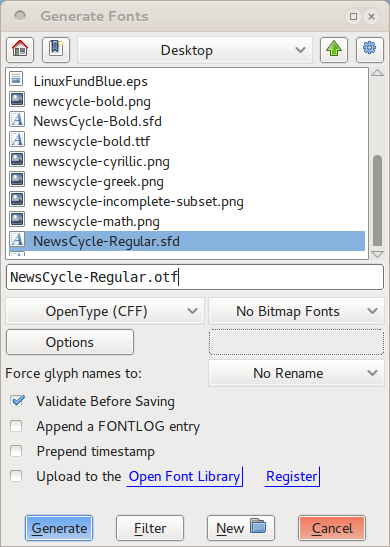
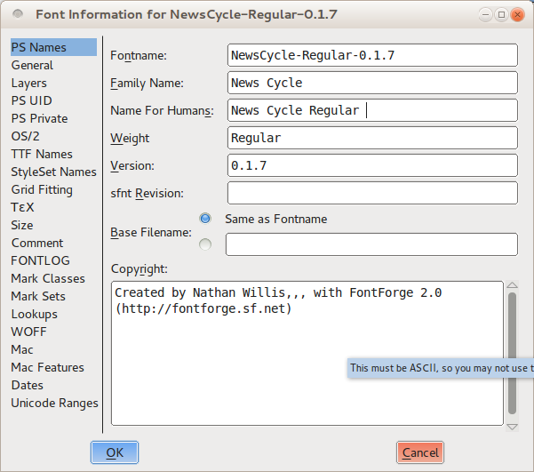
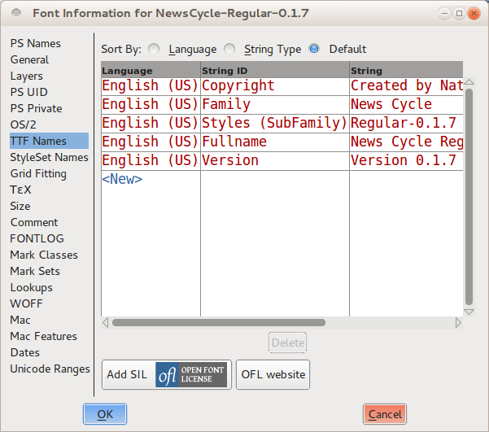

尽管你可以在FontForge中做大范围的测试，但是你将会需要生成可安装的字体文件，从而在开发进程中执行真实世界的测试。此外，你的终极目标当然是创造一个其他人可以安装和使用的输出格式的字体。不管构建字体是为了测试目的还是为其他人使用而发布，你将使用<em>Generate Fonts </em>工具（在File菜单可以找到）来构建一个有用的输出字体。但是在构建最终产品的时候，你会希望使用一些额外的步骤。

FontForge可以将你的字体导出为各种不同的格式，但是在实践中只有两种是重要的：TrueType（使用<em>.ttf</em>文件名扩展）和OpenType CFF（使用<em>.otf</em>文件扩展名）。从技术上来说OpenType格式可以包含一些其他选项，但是CFF类型是广泛使用的一个。

## 用于测试的快速的脏的一代

为了测试目的的构建字体文件 &mdash; 比如在一个网页浏览器中检查艰巨 &mdash; 你需要只确保你的字体通过了必要的验证测试。

你可以使用Element菜单下的<em>Validate Font</em>工具（更详细的解释参见验证字体一章），或者你可以选择所有的字形（按<kbd>Ctrl</kbd> + <kbd>A</kbd>或者从“Edit”菜单选择Select -&gt; Select All），然后运行一些命令来应用一些零散的基本改变。确保在你的进程更进一步之前保存你的工作，一些为了导出的验证会以微妙的方式修改你的字形的形状。

对于OpenType字体来说，首先要修正所有路径的方向。按<kbd>Ctrl</kbd> + <kbd>Shift</kbd> + <kbd>D</kbd>或者在“Element”菜单下选择Correct Direction”。接下来检查以确保没有未闭合的路径。勾选“Paths”选项卡下的<em>Open paths</em>选项，点击OK来运行测试。一旦你的字体通过测试没有错误，你就准备好生成OpenType输出。

对于TrueType字体来说，需要一些额外的步骤。你应该首先想上面描述的一样修正所有路径的方向。接下来调整所有的点使其拥有整型坐标：按<kbd>Ctrl</kbd> + <kbd>Shift</kbd> + <kbd>_</kbd>（下划线）或者从Element -&gt; Round菜单中选择<em>To Int</em>。最终，像上面描述的那样打开“Find Problems”工具，选择<em>Open paths</em>，同时在“Refs”选项卡下选中所有。

在你运行这些测试没有错误时，你需要将你的路径转换为二次曲线。从“Element”菜单打开“Font Info”窗口。点击“Layers”选项卡，勾选<em>All layers quadratic</em>选项。点击窗口底部的OK，你就准备好生成TrueType输出。

### 构建字体文件

打开“File”菜单下的<em>Generate Fonts</em>窗口。窗口的上半部分展示了熟悉的文件选择视图 &mdash; 当前目录的文件列表，一个文本框可以让你输入文件名，和导航到其他文件夹或者目录的按钮。这确实是帮你快速找到保存你的输出文件位置或者在你希望覆盖之前保存的字体文件时选择已有字体的方法。所有你需要看的选项在窗口下半部分。

在左边是一个下拉菜单，你可以选择你希望输出的字体格式。如上所述你应该选择<em>TrueType</em>或<em>OpenType (CFF)</em>。右边确保选中<em>No Bitmap Fonts</em>。在下面一行，确保“Force glyph names to:”的选项<em>No Rename</em>选中。你如果你希望，你可以检查“Validate Before Saving”选项，但是这是可选的。保留“Append a FONTLOG entry”、“Prepend timestamp”和“Upload to the Open Font Library”不勾选。

点击“Generate”按钮，FontForge将会构建你的字体文件。你可以用其他应用程序加载字体，并运行任何测试，但是当你返回编辑时，记得重新打开在生成你的<em>.ttf</em>或<em>.otf</em>输出之前保存的字体的版本。

## 生成最终版本

设计你的字体是一个迭代的进程，但是最终你必须宣布你的字体完成或者至少准备好公众消费的那天到来了。在那时，你将会再次生成一个.ttf或者.otf输出文件（或者甚至两者都有），但是在做这之前，你将需要进行一些额外步骤来创建最符合标准和用户友好的字体文件版本。

首先，遵循用于测试的快速的脏的一代一节概述的相同的准备步骤。尤其是如果你准备创建一个TrueType文件时，记得修改你的字体为<em>All layers quadratic</em>。

### 删除重叠部分

如你所知，保持你的字母形式为独立组件的联合是好主意：茎、弧、衬线和每个字形的其他部分。但是尽管这一技术对于设计和改善形式来说非常好，但是你希望你最终发布的字体每个字形有简单的轮廓。这会减少一点文件大小，但是更重要的是它减少渲染错误。

FontForge有<em>Remove Overlap</em>命令可以自动联合一个字形分开的组件组成一个轮廓。选择一个字形（或者甚至使用<kbd>Ctrl</kbd> + <kbd>A</kbd>来选择所有字形），然后按<kbd>Ctrl</kbd> + <kbd>Shift</kbd> + <kbd>O</kbd>或者从“Element” －&gt; “Overlap”菜单选择Remove Overlap。但是需要特别注意的一点是FontForge无法合并含有错误方向的形状（也就是形状外侧路径是逆时针方向）。虽说方向搞反了是路径本身的错误，不过也得需要你来修复它。

### 简化轮廓和添加极值点

你也应该尽可能简化你的字形 &mdash; 不是消除细节而是消除无用的点。这会轻微减小每个字形的文件大小，字体中全部字符集合加起来非常可观。

从“Element”菜单选择“Simplify” -&gt; <em>Simplify</em>（或者按<kbd>Ctrl</kbd> + <kbd>Shift</kbd> + <kbd>M</kbd>）。这个命令将会合并去掉所有选择的字形上的多余的曲线上的点。在某些情况下，仅会有一些点被删除，其他情况下可能有很多。但是应该执行简化后并不显著地改变任何字形的形状。如果你注意到一个特定的字形被<em>Simplify</em>修改了太多，随意撤销这个操作。你也可以尝试使用相同菜单下的<em>Simplify More</em>命令；它提供了可调分组参数可能会很有帮助。

无论如何，在你完成了简化步骤后，你将需要添加丢失的极值点。从“Element”菜单选择<em>Add Extrema</em>（或者按<kbd>Ctrl</kbd> + <kbd>Shift</kbd> + <kbd>X</kbd>）。如前所述，在你编辑时在每个字形的极值处放置曲线上的点是好主意。然而你仍然必须在准备最终输出版本时执行这一步，因为<em>Simplify</em>步骤偶尔会删除极值点。

### 一切取整为整型坐标

最后执行的准备步骤是将所有点（包括曲线上的点和控制点）取整为整型坐标。这对于生成TrueType输出来说是强制的，但是对OpenType来说也是非常推荐的。它会导致在字体显示时更锐利的渲染和更适合网格，而不需要任何额外的设计工作。

为了使所有点取整为整型坐标，选择“Element” -&gt; “Round” -&gt; <em>To Int</em>。

一旦这个操作完成，你可能注意到有东西令人迷惑。有时候仅仅由于曲线独特性引起，取整到整型坐标的进程，简化字形，增加缺失的极值点可能互相冲突。这种情况出现的一个例子是一个曲线外边有一个控制点错过了水平或者竖直方向；在这种情况下对它取整到整型坐标可能轻微地移动曲线并改变其极值点位置。

这并不是这个难题的一个一蹴而就的解决方案；仅有的保证的修复是对受影响的字形循环重复步骤直到它们在一个点稳定下来，三个操作不再互相干扰。这可能需要耗费多次循环，但是它发生是罕见的。

### 验证

你的字体在生成最终输出之前应该通过必要的验证测试。像将点取整到整型坐标步骤一样，尽管有时其他准备操作能提出错误，因此在构建最终输出之前运行全字体验证是好主意。FontForge的验证工具一章将会给你检查什么的细节。

### 关于提示（Hinting）

提示指的是使用数学上的指引在字体中渲染矢量曲线，渲染的方式是用栅格化输出设备的像素网格（不论是墨水点或墨粉在纸上构成的网格还是计算机显示器的发光点构成的网格）精细地排列起来。

FontForge允许你提示你的字体（甚至提供了一个<em>Autohint</em>功能），但是实际上这个步骤并不是严格必须的。现代操作系统经常有构建在其文本渲染引擎中的更好的网格适合功能，而不需要话费可观的时间和努力。实际上Mac OS X和Linux都会<em>忽略</em>任何嵌入字体文件中的提示。如果为了Windows用户的利益，你确实选择你的字体确实需要提示，那么你最好的办法是不使用嵌入的提示来构建字体，然后使用专门的程序比如<strong>ttfautohint</strong>来事后增加提示。

CFF提示参见RoboThon上来自Adobe的[这段视频](http://vimeo.com/38364880)。

### 检查你的元数据

最后但不是最小的事情是，一但你的字体在技术上已经完全准备好导出，你应该暂停并升级字体的元数据，确保重要的元数据信息包含在内并且是最新的。

首先，如果这是你字体的初始发布版本，从“Element”窗口打开<em>Font Info</em>对话框，选择“PS Names”选项卡。首先填写字体的Family Name和Weight，然后复制这个信息到“Name for Humans”框。尽管使用版本号不是必要的，但是它对于你这样的设计者区分你的工作的版本是非常有帮助的。如果你不确定的话输入“1.0”作为版本号。接下来打开“TTF Names”选项卡并输入同样的信息。

在使用版本号的情况下，长期为每个版本制作日志项是有帮助的。切换到“FONTLOG”选项卡并写下简明的一两句话解释你为了发布正在构建的这个版本加入的改变。如果这是你的初始日志项，那么你也应该用一两句话描述你的字体和目的。

字体像所有的创意作品一样需要有一个证书，这样用户将会知道它们允许做什么不允许做什么。FontForge的“TTF Names”选项卡有一个“Add SIL Open Font License”标签的按钮。Open Font License（OFL）是一个字体证书，设计用于允许你分享你的字体给公众，而使用的时间和用在哪里的限制很少，同事仍然保护你这样的设计者不会被其他人将你的字体归功于他自己或者创造容易被误读为原创的你的字体的衍生物。惦记按钮将会为TTF Names元数据添加“License”和“License URL”字符串。如果你更愿意使用另一个许可证而不是OFL，那么在“License”域输入它。

如果你对你的字体的其他特点做了显著的改变，那么在Font Info窗口加倍检查字宽设置，确保一切仍然是最新是好主意。例如行间距信息可以再“Mertrics”下的“OS/2”选项卡下找到。

### 构建字体文件

生成字体输出文件的进程与你构建最终发布版，测试为构建快的脏的复制版本一样，但是你将希望对选项中的一些花费更大精力。

通过选择“File”下的<em>Generate Fonts</em>来打开这个窗口。窗口的上半部分再次允许你选择输出文件的目录和文件名 &mdash; 仅需要主意你并没有覆盖上次保存的。

像前面讲的一样，在左边的下拉菜单中选择你生成的字体的格式，<em>TrueType</em>或者<em>OpenType (CFF)</em>。在右边确保<em>No Bitmap Fonts</em>被选中。在下面的一行确保“Force glyph names to:”一项选中<em>No Rename</em>。如果你希望（可能捕获额外的错误）就可以勾选“Validate Before Saving”，但这是可选的。“Append a FONTLOG entry”、“Prepend timestamp”和“Upload to the Open Font Library”选项保持不勾选。

接下来点击“Options”按钮，在弹出的窗口中选中<em>PS Glyph Names</em>、<em>OpenType</em>和<em>Dummy DSIG</em>选项，并且不选中其他所有项。

点击“Generate”按钮，FontForge将会构建你的字体文件。最后一句话：重要的是不要用你在这一节单独为了生成你的<em>.ttf</em>或<em>.otf</em>输出而做的修改覆盖你的FontForge工作保存的版本。例如你当你执行<em>Remove overlaps</em>操作的时候丢失了许多独立字形组件。但是下次你继续你的字体工作时，你将肯定希望找回你在原作中丢下的独立字形组件填充的版本。

因此，如果你决定保存你的FontForge文件修改过的版本，确保将其重命名为显著的名字，比如<em>MyFont-TTF.sfd</em>或<em>MyFont-OTF.sfd</em>。但是你完全不必保存你的文件的这些面向输出的多种版本 &mdash; 实际上下次你在FontForge中修改你的原作时，无论如何你将再次做完输出准备步骤。

接下来要恭喜了！你创建了你的第一个字体。对你来说剩下的只是分享你的作品；上传到网上，贴到博客中，告诉你的朋友们。

毫无疑问你将会继续校正和改善你的字体样式 &mdash; 如你所见，字体设计终究是一个高度迭代的进程。但是确保你暂停一下，先把握这个时刻享受你所完成的。