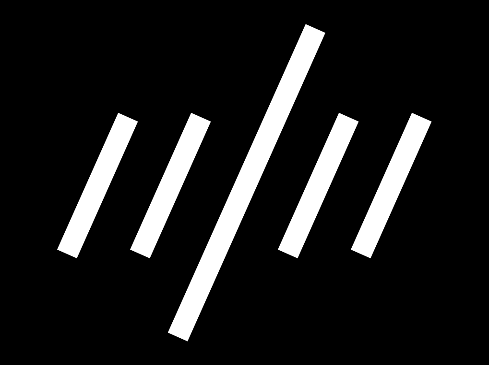
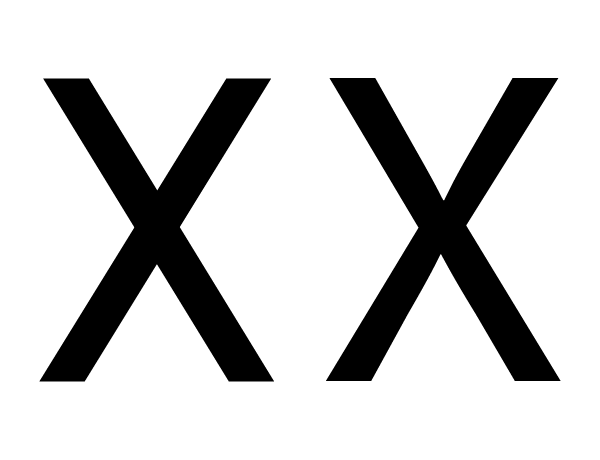
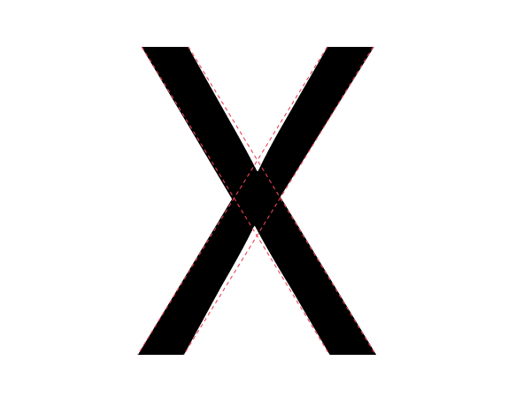

字体设计是迭代地测试每个选择，共同合成一个完整的设计的进程。你将会一直测试字体，看你做出选择的合并结果是否能够：

* 对你来说可读
* 字体让你觉得好
* 字体对于你希望它能够完成的工作有帮助

在你测试设计的时候，你要相信自己的认知，设计实际的东西。许多字体设计都需要你设计的字体类似并且形式上重复。

人们很容易认为如果你测量字形的组成部分和间距，那么你将得到可靠的结果。虽然很有用，但是这个方法有实际的限制。如果有什么看起来错了，那么你应该期望做出调整。更进一步来说，你应该确信正确的做法是作出修改直到它“看起来正确”。

这正确的原因是由一些所有读者都会有的自然的视觉错觉。这些错觉必须在你修改字母形状的时候计算在内，直到他们看起来正确。

通过[这些视频](https://vimeo.com/typereview/videos) （外部链接）你可以大致的了解一般都是通过修改或者注意哪里来修正这些视觉错觉。

## 错觉的例子

一些错觉涉及对线条的粗细的感知，一些涉及线条的长度，另一些设计形状的感知。

### 水平与竖直的粗细程度

左边的例子展示了一个条形粗细相同的“H”。这看起来是不对的。你能感受到吗？右边的另一个水平的条形做的更细，这样看起来粗细相等。

需要按照视觉做出调整的字形有很多，包括A、E、F、L、H、f、t和z。

### 斜向粗细

类似地，如果一些条形宽度相等，其中一个放在斜线上，那么斜向的条形看起来比竖直的条形粗并且比水平的条形细。如果你想让它看起来正确，那么你不得不像水平的例子一样将其调细一点，但是只是细一点点。

令人产生错觉的相关字形十分多，包括k、K、N、Q、R,
v、V、w、W、x、X、y、Y、7、2、&amp;、ł、Ł、&oslash;、&Oslash;、&radic;、∕、&lsaquo;、&rsaquo;、
&laquo;、&raquo;、&frac12;、&frac13;、&frac14;、&le;、&ge;和&times;。

### 宽度和对斜向角度的感知

更长的图形需要比短的图形倾斜更少，这样表面上看起来他们倾斜度相同。

下面的图中的斜线倾斜角度相同。长的那个看起来角度不同。

在下图中，长的线条的倾斜程度被调整过：

现在我们来看真实的斜体，在字形上应用了这些修正：

### 交叉斜线

当一个条形穿过另一个斜线或者直线时，需要调整它以便看起来不像是没有对齐。

上面的例子中，左边的X由两个未调整的条形互相交叉。右边的例子被调整过，这样看起来是对齐的。

在这个X中通过虚线你可以看到看起来显得对齐的X实际上有偏移。

涉及到这个错觉的字形包括x、X、k、K、×、#和冰岛语字母“eth”（&eth;）。

### 高度感知

一个字形的形状将会对它看起来和其他字形高度一致时的高度产生作用。圆的字形需要超过平的字形的高度一点点。包含尖的形状的字形需要超过更多。形状越尖锐，它为了看起来正确需要超过的就更多。

在上图中，上面的三个图形没有经过调整，也就是他们有完全相同的高度。下面的三个图形经过调整，看起来有更加接近的高度。

这一错觉涉及到包含圆的或尖的部分的人和字形，包括O、Q、C、S、A、V、W等。

## 你完全有资格来纠正这些错觉

由于你既能看到错觉，也能看到修正错觉的效果，所以你能够自行作出这些修正。你仅仅需要相信你的印象。

## 测试目的的适当性

就像你能够看到光学错觉并纠正他们一样，你也有能力去分辨一个字体是否胜任你心目中特定的用途。在这一点上你也同样需要相信你的判断。

值得一提的事没有字体能够在离开其使用方式和目的的情况下被评估。这也是测试需要从设计进程最开始一直到你觉得项目完成的原因。

这些测试会是什么样子呢？开始的测试比较简单，你只需测试第一个设计的选择。随着你的设计变得更加完整，你的测试需要跟上进度并且能够评估你所做的最新的决定相对成功还是失败 &mdash; 或者更好的情况是能够比较你所考虑的2个（或者3个或者更多&hellip;）选项。

有时你将发现你不得不折返修改你之前认为已经足够好的设计选择。这是常态。制作一个字体需要平衡很多因素，惊奇经常会发生。设计的字体越多，你做任意选择的经验也就越多。

当接近进程的尾声的时候，如果字体采用简单的方式来使用，那么测试也应该保持简单。但是如果一个字体将会有多种使用方式，或者在大范围的打印或屏幕环境下使用，那么测试应该覆盖这些情况的所有范围，包括打印字体的各种样例。

如果你对你打算的最终用途有明确定义的想法，那么设计时间将得到节省。但是这并不总是可行的，你的想法可能发展。关键的东西是考虑并定义尽你所能完整的用例，然后确保在设计字体时你的测试跟上你问自己的问题。
