什么使得手写、书法、印刷和Logo的字体样式不同？

使字体设计不同的一个最大的问题是需要字体样式中的每一个字形与其他字形的一起工作。这通常意味着字体样式中的每一部分的设计和间距最终要成为仔细折中的一个系列。这些折中意味着我们最好能够将字体样式设计看作是创造一个字母的美妙集合而不是一个美妙字母的集合。换句话说我们必须思考整体以及他们如何一起运转，并且其优先级要高于一个字母的精妙之处的问题。

这需要我们要使系统优先于每一部分，也导致了我们在系统的层面来分析我们的设计进程。特征超越字母成为我们想要关注的东西，尤其是在设计进程初期。

在字体设计中其他怪异的地方在于我们设计的形式在很大程度上已经显著建立。我们设计字体的任务并没有建立全新形式那么重，而是建立一个已有形式的新版本。这可能使新的字体设计者感到困惑。找到合适数量的改变来激励他们同时也不使读者感到疏远使一件棘手的事情。设计者通常会陷入具体字母的思考。如果你一开始意识到字体样式中最有意义的是其中重复最多的那些组成部分，那么能够很容易地避免这个错误。字体样式设计不是仅是关于设计特征应用在我们所认识的通用形式上，也是应用在最常出现的形式上。

特征不仅有助于创造字体的声音或者氛围，也能确定字体对什么有用或者没用，并且又是也有助于确定一个字体所适合的技术背景。认同这些是有帮助的。

按照这种方式思考字体设计可能是吓人的和过度抽象的。但是习惯这些想法是使得字体设计进程更加快速、高效和令人满意的关键。

让我们将识别字体设计的主要的系统特征作为开始。

### 结构

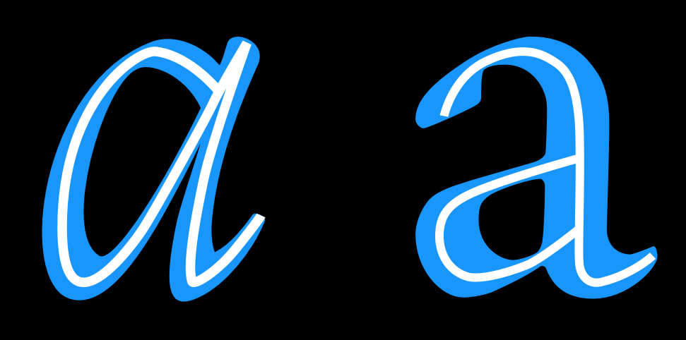

结构指的是形成特定字形的基础笔画的构造。你可以想象是字形的骨架。可以说采用什么构造是需要思考的最重要的问题之一，因为结构影响到如此多余下的选择，尤其是当你的设计需要让读者感到几分熟悉的时候。在上述例子中，字母中白色的线条指示出字母本身所暗含的粗略估计的结构。

但是末端的方式（终止节点）和衬线（如下）通常不是“结构”的含义的一部分。结构是一个字形的骨架，而剩下的 &mdash; 宽度、粗细、末端 &mdash; 都是血肉的一部分。

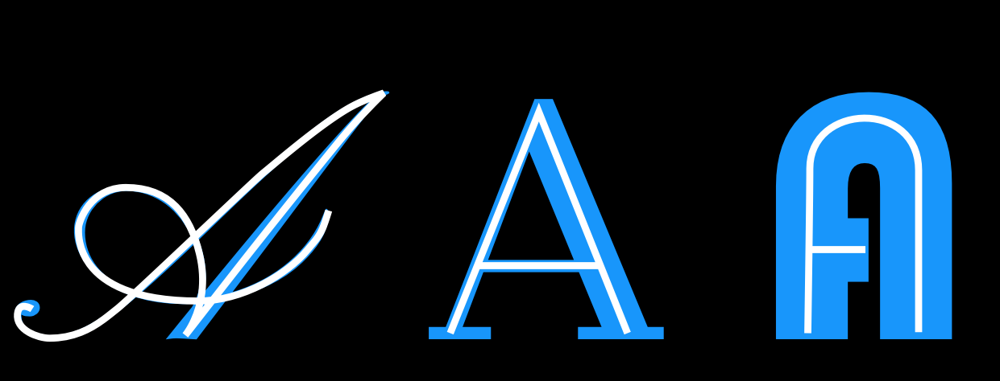

### X高度到大写高度的比例

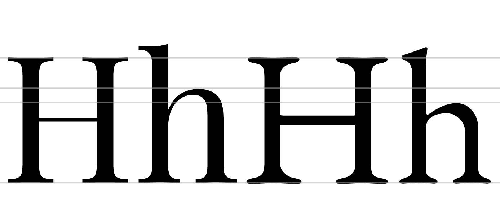

左边的字母来自[Playfair Display]，相比于大写高度，x高度较大。右边的字母来自[EB Garamond]，X高度较小。上面的例子中，字母H的高度被调整过，这样他们可以对齐。

### 顶高

上面的例子中，为了演示在顶高上的相对差别，我们对齐了X高度。

顶高经常至少超过大写高度一点，尤其是在文字设计中。但是在某些情况下他们可能相等或者顶高比大写高度更低。更高的顶高能够让字体样式看起来更加优雅。他们通常X高度更小。

### 底深

类似于顶部，更长的底部也能让人觉得更加优雅。

总之，更长的顶部和底部能够变得难以管理。如果字体样式使用了小的行高，典雅意味着字体可能跨越字体的行导致碰撞。

## 宽度

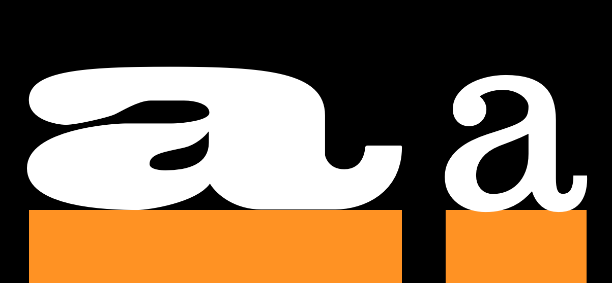

字体设计的宽度将不仅改变其感觉，也会改变其用途。右边的例子来自一个文本样式。左边的例子来自一个显示设计，目的是要醒目。字母比文本样式例子更加细，能够节约空间或者用于在小的空间内放下更多文本。

### 宽度不变与可变

上面的一行字母的宽度变化比下面一样要更大。

### 粗细

### 倾斜

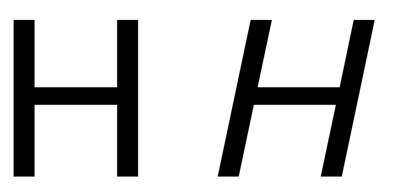

### 对比

对比指的是一个字形内能够找到多少笔画宽度的变化。注意在下面的两个“O”字形中，左边的从顶部到侧边的线条粗细比右边的变化更大。两个字形都有一些对比，但是左边那个字母的对比比右边的要大得多。

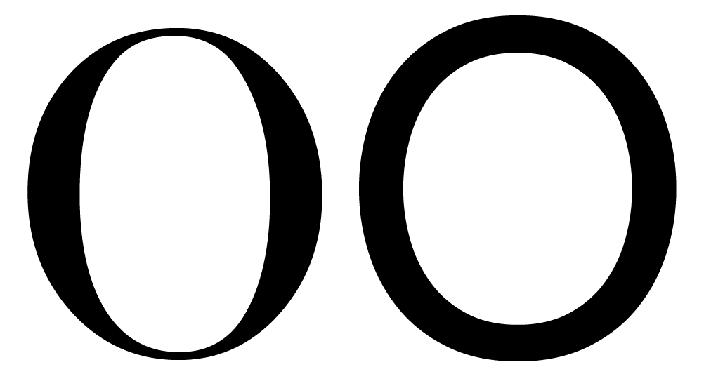

在其字母形式中有一致的粗细（笔画宽度）或者没有可见的对比的字体产生了与对比字体的完全区别。就像衬线与与无衬线之间的选择，对比时字体设计中的一个早期选择。有趣的是，厚衬线设计通常在字母中使用一致的笔画宽度。厚衬线设计不像听起来那样仅仅是关于衬线！需要记住的是感觉应用的规则（参见[“相信你的眼睛”][“Trusting your eyes”]） &mdash; 对比是关于粗细看起来怎样，而不是测量后应该是多少。

### 对比的角度

在下面的图中，我们看到小写字母“o”较细部分的形状是不同的。在左边的字形里，细的点完美地落在竖直轴上。在右边的字形中坐标轴是对角线。

### 粗细分布

如果你很少使用对比，那么你并不需要考虑它。但是大多数字体都包含一定程度的对比。在这些情况下，在你的字体中如何分布粗细将会有更加广泛的选择空间。

#### 竖直

粗细的竖直分布很常见。上面的9和8是尤其强烈的例子。

#### 水平

粗细的水平分布很少见，但是仍然能看到很多字体。

#### 底重

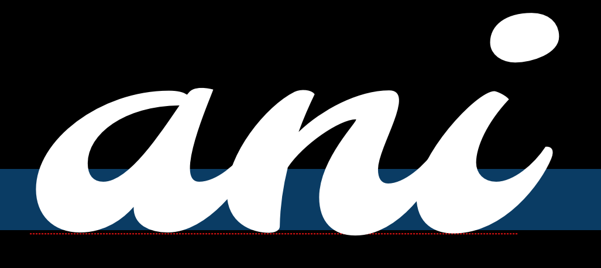

#### 顶重

#### 不规则

### 茎

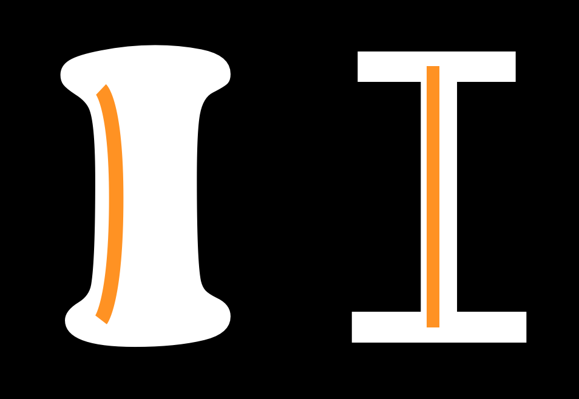

可能你容易假设你的茎会简单地呈笔直，这一点不是真正应该关心的。但是茎的粗细和形状是你应该做出深思熟虑的选择的。

### 连接

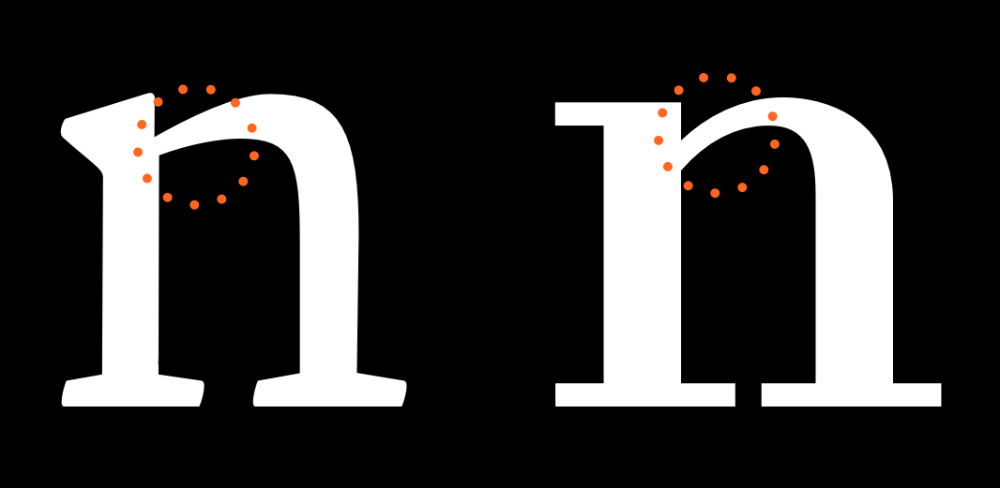

### 弧

需要注意的是弧（bowl，译者注：指的是在字符中创造出闭合空间的弧线笔画）指的是下面标示出来的笔画的部分，而不是内部的黑色部分。内部绘制的被称为“对立面”。在设计字体时，你可能经常发现需要修改你的作品，不是因为笔画的形状和宽度，而是由于对立面的形状和颜色。

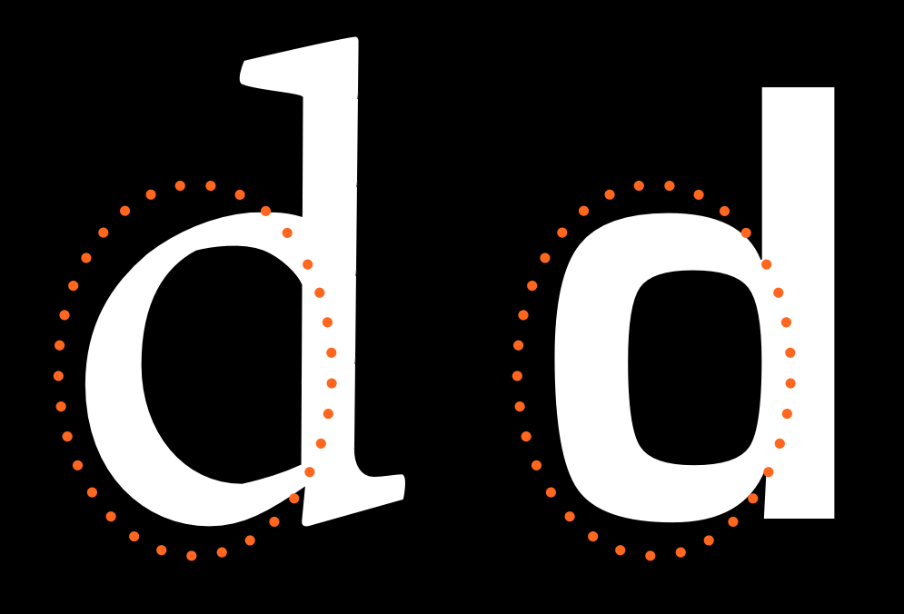

### 末端

末端指的是末端的形式。它们与衬线是不同的。它们通常末端的角度的垂线，或者水平或竖直地修剪。它们也反映出笔尖的形状或者字母形式的其他创作工具。

### 速度

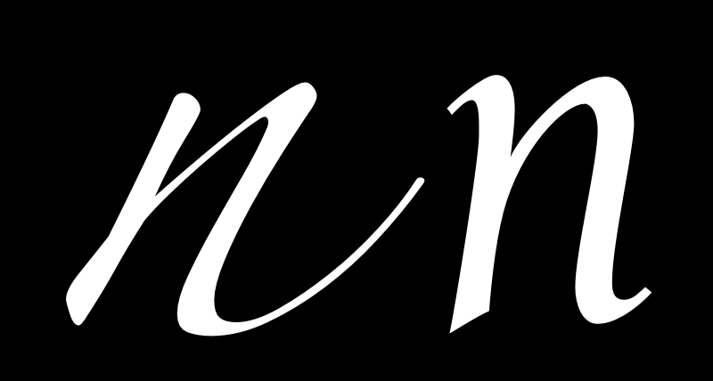

左边的“n”看起来比右边的字母写得要快很多。对速度更详细的讨论参见章节[斜体][on italics]。

### 规则性

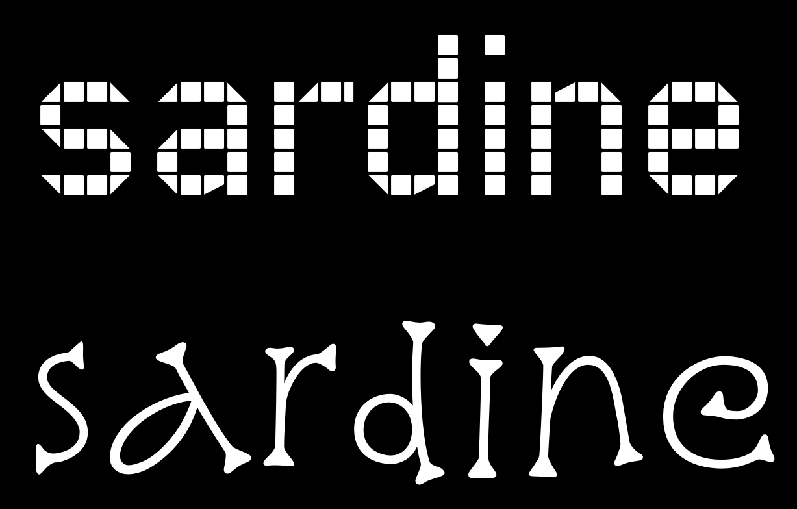

下列特征并不会出现在所有的字体设计中，但是它们是可能成为你设计的一部分的可变因素。如果是这样的话，值得考虑它们作为可变因素的程度。

### 茂盛

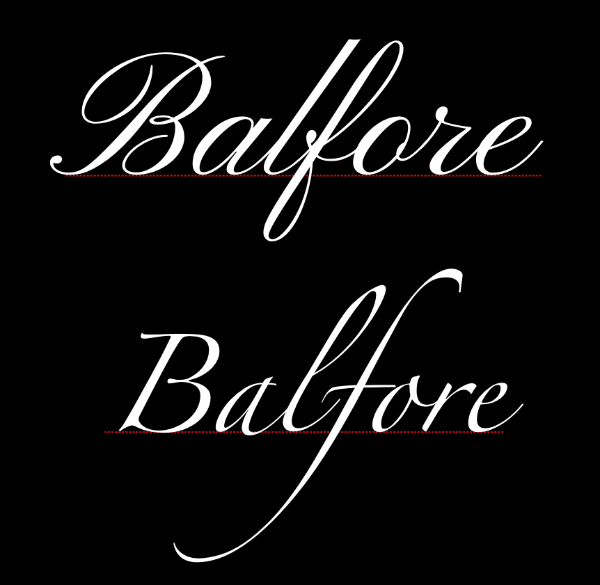

需要注意的是上方字体的茂盛更多地体现在大写字母中，而第二个的茂盛更多地体现在小写字母中。

### 衬线

衬线是一个字体中最显著区别的方面之一。通常字体的一级分类就是衬线和非衬线字体。

这个选择影响了末端看起来怎么样。衬线可以是两端或者一端的。它们可以是垂直绘制的，或者有自己的方向（好像总是水平或者竖直的）。衬线可能有或者没有括号。任何衬线设计时上述的所有特征与特别字母的差异，尤其是“S”，“C”和“Z”,一致地应用在字体设计中（例如一个所有字母都包含水平衬线的字体的s，c和z字母经常有竖直的衬线。）。

一个都市传奇主张认为衬线字体笔比非衬线字体更易读 &mdash; [一个独特的迷思](http://asserttrue.blogspot.se/2013/01/the-serif-readability-myth.html)，直到另行通知。

衬线的形式与末端的形式相关。

#### 支架

连接着主要笔画的衬线的拐角部分被称作“支架”。一个特别的设计可能采用它们来给衬线加入柔和感（[Times New Roman]就是一个例子）或者可能选择不加支架。一些设计可能只在一端使用支架或者两端比例不同。

这是一个给字体渲染感觉的比较强烈的参数 &mdash; 优雅（[Times New Roman]的平滑或大的支架）或者粗短干脆（[Arvo]没有支架）。

#### 厚板衬线

也成为机械或者埃及字体，厚板是厚的块状衬线。厚块衬线不使用支架。通常说来，又这样的衬线的字体设计在字形上会更少使用对比 &mdash; [Rockwell]、[Courier]或[American typewriter]体现了这一点。

我们可以可靠地假设厚板衬线使用来在一个其他方面没有对比的字体设计中加入装饰或者节奏。但这也不是绝对的规则。

#### 衬线结束

就像字母结束那样，衬线本身的结束形状对字体的感觉有帮助 &mdash; 使其柔软或短粗。衬线结束可以是柔软圆角的（[Courier]）或者有棱角的（[Rockwell]）。

### 装饰

<!--  -->

### 维度

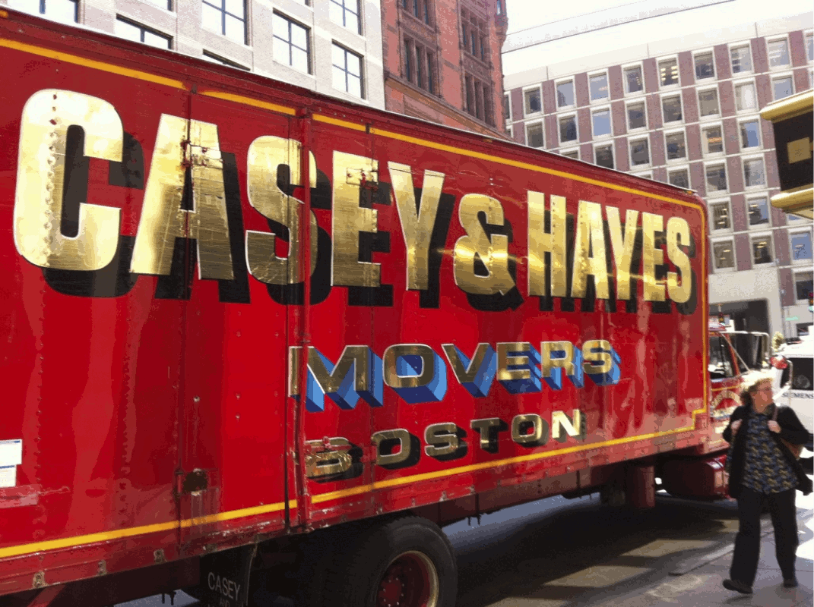

[Playfair Display]: http://www.forthehearts.net/typeface-design/playfair-display/
[EB Garamond]: http://www.georgduffner.at/ebgaramond/
[“Trusting your eyes”]: Trusting_Your_Eyes.html
[on italics]: Italic.html
[Times New Roman]: http://practicaltypography.com/times-new-roman.html
[Arvo]: http://files.korkork.com/index.php?/fonts/arvo/
[Rockwell]: http://www.myfonts.com/fonts/mti/rockwell/
[Courier]: http://typedia.com/explore/typeface/courier/
[American typewriter]: http://www.myfonts.com/fonts/linotype/itc-american-typewriter/

*待办事项：正式的元素如何适应文化和文化如何形状和字母间的间距表现出来是在设计学校中没有人会教你的“秘密”，应该在本页应解释 :)*
